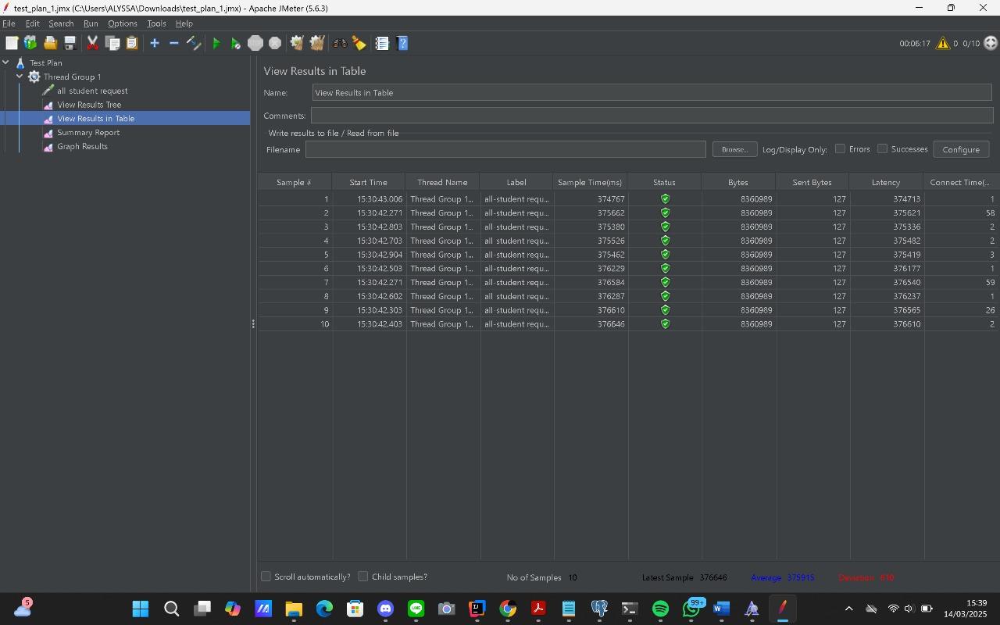
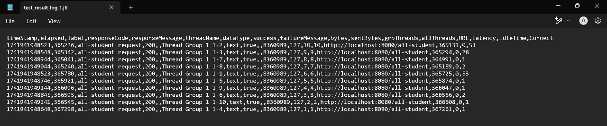
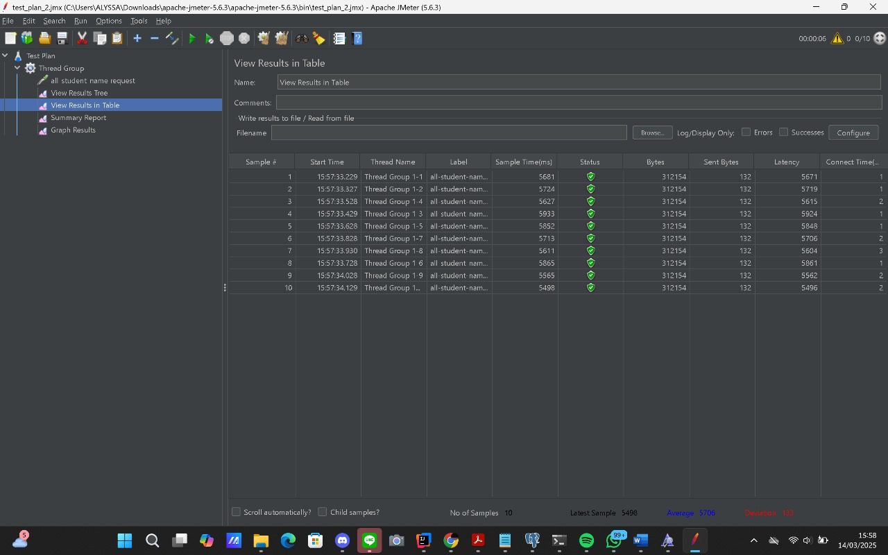
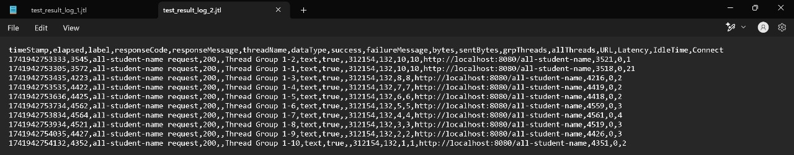
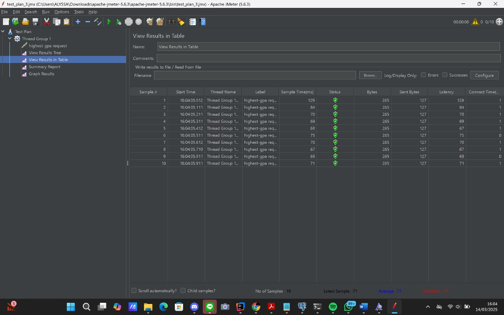
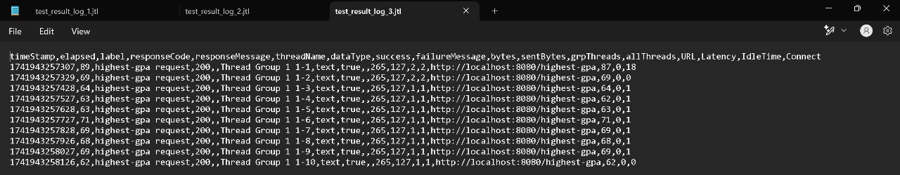
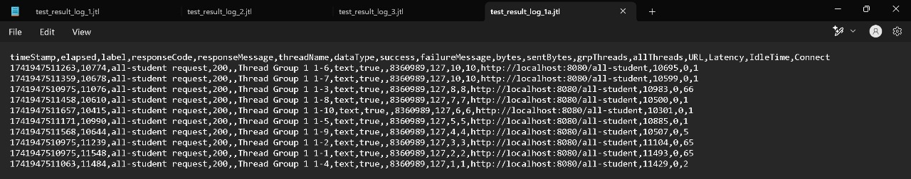
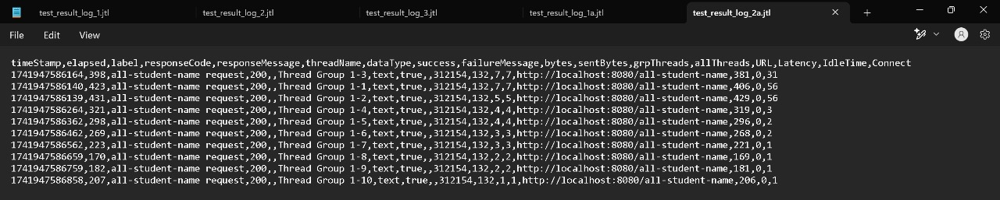
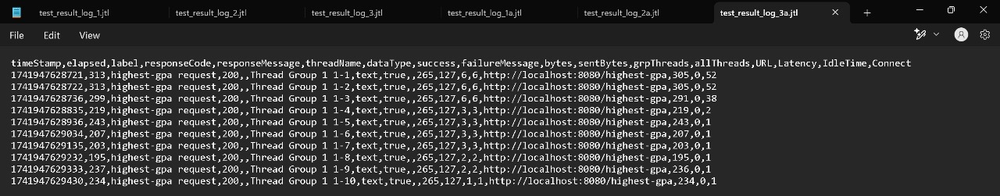

*Nama*: Alyssa Layla Sasti   
*Kelas*: AdPro B   
*NPM*: 2306152052  

# MODULE 5 ADPRO

## SCREENSHOTS of JMETER GUI & CMD
### BEFORE OPTIMIZATION
- All Student JMeter GUI
  

- All Student CMD
  

- All Student Name JMeter GUI
  

- All Student Name CMD
  

- Highest GPA JMeter GUI
  

- Highest GPA CMD
  

### AFTER OPTIMIZATION
- All Student CMD After Optimization
  

- All Student Name CMD After Optimization
  

- Highest GPA CMD After Optimization
  

## REFLECTION MODULE 4
Please answer the following questions:
1. What is the difference between the approach of performance testing with JMeter and profiling with IntelliJ Profiler in the context of optimizing application performance? 
- JMeter digunakan untuk performance testing, yaitu mengukur bagaimana aplikasi menangani beban kerja tertentu. Dengan JMeter, kita dapat melakukan uji coba seberapa kuat aplikasi/code bisa menanggung load dari banyak user dalam satu waktu. 
   JMeter memberikan output kepada pengguna berupa response time, throughput, load server, konsumsi sumber daya server, dan skalabilitas aplikasi. Sementara itu, IntelliJ Profiler digunakan untuk profiling, yaitu menganalisis performa aplikasi di tingkat kode. 
   Alat ini membantu mengidentifikasi metode atau proses yang mengonsumsi CPU secara berlebihan, alokasi memori yang tidak efisien, serta potensi bottleneck dalam eksekusi kode. Dengan demikian, profiling lebih berfokus pada optimasi kode secara mendalam, 
   sedangkan pengujian performa dengan JMeter lebih menilai bagaimana aplikasi berjalan dalam kondisi nyata dengan banyak pengguna.

2. How does the profiling process help you in identifying and understanding the weak points in your application?
- Profiling memungkinkan kita untuk mendapatkan gambaran rinci mengenai bagaimana aplikasi menggunakan sumber daya. Profiling bisa memberi gambaran metode mana yang lama untuk dieksekusi dan memori yang ada dipakai untuk apa saja. Selain itu, profilling juga dapat
   mengidentifikasi apakah ada kebocoran atau tidak dan apakah ada deadlock atau tidak.

3. Do you think IntelliJ Profiler is effective in assisting you to analyze and identify bottlenecks in your application code?
- IntelliJ Profiler merupakan alat yang cukup efektif dalam membantu analisis performa kode dikarenakan mampu untuk memberikan visualisasi eksekusi kode secara real-time. Selain itu, IntelliJ Profiller juga terintegrasi langsung dengan IntelliJ IDEA, sehingga mempermudah proses debugging dan optimasi tanpa perlu menggunakan extention.

4. What are the main challenges you face when conducting performance testing and profiling, and how do you overcome these challenges?
- Tantangan dalam pengujian performa dan profiling adalah hasil pengujian performa dan profiling tidak konsisten. Hal yang mungkin terjadi adalah adanya perbedaan antara hasil yang diperoleh di lingkungan pengembangan dan pengujian beban tinggi. 
   Solusi yang saya lakukan adalah saya memastikan kondisi lingkungan serupa dan analisis faktor-faktor seperti concurrency dan caching yang dapat memengaruhi hasil.

5. What are the main benefits you gain from using IntelliJ Profiler for profiling your application code?
- Beberapa manfaat utama dari penggunaan IntelliJ Profiler adalah dapat mendeteksi metode yang paling banyak mengonsumsi CPU dan memori, sehingga dapat dilakukan optimasi yang lebih tepat.
   Selain itu, IntelliJ Profiler juga menyediakan visualisasi yang intuitif untuk memahami bagaimana kode dieksekusi. Hal yang menurut saya merupakan salah satu manfaatnya adalah ini sudah terintegrasi langsung dengan IntelliJ IDEA, sehingga mudah digunakan.

6. How do you handle situations where the results from profiling with IntelliJ Profiler are not entirely consistent with findings from performance testing using JMeter?
- Jika hasil dari IntelliJ Profiler dan pengujian performa dengan JMeter tidak sepenuhnya konsisten, kita dapat melakukan berbagai cara, salah satunya adalah memeriksa perbedaan lingkungan pengujian, 
   karena kondisi di lingkungan pengembangan mungkin tidak mencerminkan kondisi sebenarnya saat aplikasi berada di bawah beban tinggi.

7. What strategies do you implement in optimizing application code after analyzing results from performance testing and profiling? How do you ensure the changes you make do not affect the application's functionality?
- Setelah melakukan analisis hasil pengujian performa dan profiling, beberapa strategi optimasi yang saya lakukan adalah Refactoring kode yang tidak efisien, misalnya mengoptimalkan metode - metode yang repetitif atau bertele-tele, sehingga kode
   bisa menjadi lebih straightforward dan langsung sesuai dengan fungsinya. Kemudian saya juga memastikan bahwa kode tidak terlalu panjang untuk hal yang tidak perlu, sehingga kode pendek dan fungsinya jelas juga tidak menggunakan banyak memori yang sebenarnya tidak diperlukan.